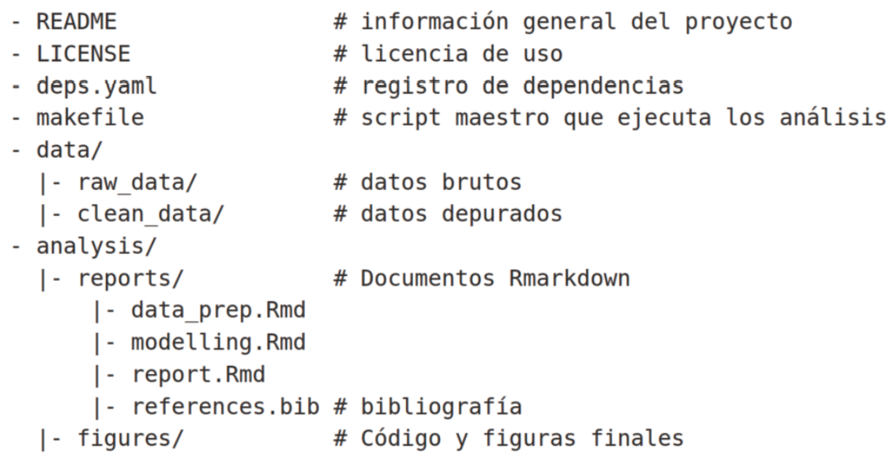

```{r setup, include=FALSE}
knitr::opts_chunk$set(echo = TRUE)
```

# Introducción

Nunca hemos recibido formación sobre buenas prácticas de programación. En consecuencia, nuestro código es a menudo ineficiente, desordenado, propenso a errores, difícil de revisar y reutilizar.

En este sentido, es más que recomendable seguir una serie de protocolos y de buenas prácticas para programadores. De lo contrario, este proceso tan elaborado podría complicarse más de lo necesario.

## Recomendaciones generales.

1.  **Prioriza la legibilidad**. Debes escribir un tipo de código que cualquier desarrollador pueda comprender.

2.  **Lee mucho código fuente**. Si te esfuerzas en comprender el código de otros desarrolladores, podrás comprobar en un instante las diferencias entre código de calidad y código mediocre.

3.  **Coloca comentarios**. Si te encuentras en una fase de aprendizaje, lo mejor es que coloques comentarios en tu propio código. Además, si un tercero tiene que acceder a tu código, los comentarios le facilitarán la tarea.

4.  **Testea tu código**. Encontrar un error a tiempo y solucionarlo evitará problemas en el futuro.

## Recomendaciones generales.

5.  **Simplifica al máximo**. Trata de evitar la construcción de código complejo siempre que sea posible.

6.  **Realiza control de versiones**. De esta manera podrás conocer en qué estado se encontraba el código antes y después de ser modificado.

7.  **No utilices caracteres únicos del español**. Los archivos cuyo código contenga estos caracteres no recomendados podrían sufrir alteraciones al abrirse en diferentes equipos. Por ello, es recomendable que escribas código en inglés.

## **Características de un buen programador**

::: incremental
1.  **Es autodidacta**. Es importante que te intereses por el tema de la programática, que tengas inquietudes al respecto y que, fundamentalmente, disfrutes programando.

2.  **Evita la frustración**. Trabajar con código ajeno o tratar con datos desactualizados puede dificultar tus tareas profesionales, pero debes perseverar y seguir adelante.

3.  **Apuesta por la innovación**. Es necesario escuchar a otros profesionales del sector y aceptar consejos, pero también ir más allá e idear nuevas soluciones.

4.  **Observa con detenimiento**. El entorno de la programación es casi tan exacto como el de las matemáticas.
:::

# Buenas prácticas de programación en `R`

### Utiliza un sistema de control de versiones

En lugar de guardar distintas versiones de nuestro código como `script_v1`, `script_v2`, etc., es muy recomendable utilizar herramientas como `git` que permiten tener un archivo perfectamente organizado de todos los cambios realizados en datos y código.

## ¿Qué son Git y GitHub?

1.  **Git** es un software de código abierto para el control de versiones.

2.  **GitHub** es el servicio más popular para colaborar en código usando Git.

## ¿Por qué usar Git y GitHub?

1.  El uso de Git y GitHub sirve como copia de seguridad.

2.  El uso de Git y GitHub permite trabajar en el mismo proyecto al mismo tiempo que los colaboradores.

## Instalar Git

1.  [Crear una cuenta en github](https://github.com/)

2.  Instalar Git. Descargar [Aquí](https://gitforwindows.org/)

3.  Configurar Git.

    ```{r, eval=FALSE}
    install.packages("usethis")
    library(usethis)
    usethis::edit_git_config()
    ```

4.  Crear un proyecto en **Rstudio**

5.  Activar git

    ```{r, eval = FALSE}
    library(usethis)
    usethis::use_git()
    ```

## Conectar Rstudio y Github

1.  Crear un token de acceso personal (PAT) en GitHub: La mejor manera de conectar RStudio y GitHub es usando su nombre de usuario y un token de acceso personal (PAT).

    ```{r, eval=FALSE}
    library(usethis)
    usethis::create_github_token()
    ```

    -   Pulsar sobre el enlace que aparece en la salida en la consola.

    -   Abrirá una página web de Github en la que se tendrá que pulsar el botón "Generate token".

    -   Copiar el token que aparece en Github (luego se utilizará en el siguiente paso).

## Conectar Rstudio y Github

2.  Conectar con GitHub.

    ```{r, eval=FALSE}
    install.packages("gitcreds")
    library(gitcreds)
    gitcreds::gitcreds_set()
    ```

3.  Llevar nuestro proyecto a GitHub

    ```{r, eval=FALSE}
    library(usethis)
    usethis::use_github()
    ```

## Flujo de trabajo

-   Push (Subir a Github)

-   Pull (Descargar desde Github)

\pause

```{=tex}
\Huge
\center
```
¡Ahora está todo configurado para usar Git y GitHub con RStudio!

## Buenas prácticas de programación en `R`

### Utiliza una estructura estándar de proyecto

Idealmente, todos los archivos relacionados con un proyecto (datos, código, figuras, etc.) deben alojarse en la misma carpeta

### Añade un fichero README al directorio raíz de tu proyecto

Añade un fichero README al directorio raíz de tu proyecto que sirva como presentación del mismo objetivos y elementos del proyecto, desarrolladores, licencia de uso, cómo citarlo, etc.

### Utiliza un script maestro ('makefile')

En proyectos relativamente complejos, donde se manejan varios conjuntos de datos o scripts de código, es muy recomendable tener un script maestro que se encargue de ejecutar todas las piezas en el orden correcto

## Buenas prácticas de programación en `R`

### Evita guardar el espacio de trabajo.

En general, es preferible no guardar el espacio de trabajo al finalizar cada sesión de trabajo, para evitar la acumulación de objetos innecesarios en memoria.

### Aprovecha las ventajas de Rmarkdow

Rmarkdown facilita la colaboración y comunicación de resultados, y reduce drásticamente el número de errores

## Buenas prácticas de programación en `R`

### Comenta tu código

Utiliza los comentarios para guiar al lector, distinguir subsecciones, o explicar por qué se hacen las cosas de una determinada manera

### Utiliza nombres memorables para los objetos

Utiliza nombres con significado que resuman el contenido o función del objeto

### Documenta los datos.

Prepara metadatos explicando qué representa cada variable (tipo de medida, unidades), autores, licencia de uso...

## Buenas prácticas de programación en `R`

### Comprueba los datos antes del análisis

En cualquier proyecto puede ocurrir que los datos de partida contengan errores (introducidos al teclear los datos, importarlos o manipularlos). Paquetes como `assertr`, `validate` o `pointblank` resultan muy útiles para comprobar la calidad de los datos antes del análisis

### Escribe código modular

Los scripts de código largos y desorganizados son más difíciles de revisar y, por tanto, más proclives a contener errores.

## Buenas prácticas de programación en `R`

### Evita repeticiones en el código

A menudo necesitamos ejecutar unas líneas de código repetidamente.

### Registra las dependencia

Todo análisis depende de un conjunto de paquetes que conviene documentar de manera consistente e interpretable. Ello nos permite, por ejemplo, ejecutar fácilmente el análisis en otro ordenador, o recrear el entorno computacional tras una actualización

```{r, eval=FALSE}
  sessionInfo()
```

## Ejemplo de estructura de proyecto



# Guía de estilo de codificación

## ¿Qué es el estilo de codificación?

El estilo de codificación es un conjunto de reglas sobre el scritp, la estética (alineación y espaciado de código) pero también la nomenclatura (de variables, funciones, etc.), comentarios, estructuración (por ejemplo, evitar la lógica compleja), etc. Estas reglas ayudan a mejorar la claridad del código y la colaboración.

## Nombre de archivos y otros

::: incremental
-   Los nombres de archivo deben ser significativos y terminar en `.R` Evite el uso de caracteres especiales en los nombres de archivo.

-   Si los archivos deben ejecutarse en un orden determinado, prefijarlos con números.

-   **Organización**: La mejor regla general es que si puedes darle a un archivo un nombre conciso que evoque su contenido, han llegado a una buena organización.

-   **Estructura interna**: Use líneas comentadas de y para dividir su archivo en trozos fácilmente legibles.

-   **Librerias**: Cárguelas todas a la vez al principio del archivo.
:::

# Sintaxis

### Nombres de objetos

-   Los nombres de variables y funciones deben usar solo letras minúsculas, números y guion bajo `_`.

Ejemplo

:   
    ```{r, eval=FALSE}
    pba_one
    pba_1
    ```

-   Los nombres de variables deben ser sustantivos y los nombres de funciones deben ser verbos. Esfuérzate por nombres que sean concisos y significativos

-   Evite reutilizar nombres de funciones y variables comunes.

## Nombres de objetos

Ejemplo
: Errores comunes 
    ```{r, eval=FALSE}
    T <- FALSE
    c <- 10
    mean <- function(x)
      sum(x)
    sum <- function(x)
      diff(x)
    ```

## Espaciado

Comas
: Siempre ponga un espacio después de una coma, **nunca antes**.

    ```{r, eval = FALSE}
    # Bien
    x[, 1]
    
    # Error
    x[,1]
    x[ ,1]
    x[ , 1]
    ```
  
## Paréntesis 
No coloque espacios dentro o fuera de los paréntesis para cuando utilice las funciones.

```{r, eval = FALSE}
    # Bien
    mean(x, na.rm = TRUE)
    
    # Error
    mean (x, na.rm = TRUE)
    mean( x, na.rm = TRUE )
```

## Paréntesis 

Poner espacios antes y después de usar paréntesis cuando se una las funciones `if`, `for` y `while`  

```{r, eval=FALSE}
    # Bien
    if (debug) {
      show(x)
    }
    
    # Error
    if(debug){
      show(x)
    }
```

## Paréntesis

Coloque un espacio después de usar `()` para los argumentos de una función.

```{r, eval=FALSE}
# Bien
function(x) {}

# Error
function (x) {}
function(x){}
```

## Llves `{{ }}`

Las llaves `{{ }}`, siempre debe tener espacios interiores para ayudar a enfatizar su comportamiento especial.

```{r}
# Bien
Mi_funcion <- function(data, var, by) {
  data %>%
    group_by({{ by }}) %>%
    summarise(maximum = max({{ var }}, na.rm = TRUE))
}
# Error
Mifuncion <- function(data, var, by) {
  data %>%
    group_by({{by}}) %>%
    summarise(maximum = max({{var}}, na.rm = TRUE))
}
```

## Otras recomendaciones.
-   Siempre uses los operadores `==`, `+`, `-`, `<-`, etc. siempre deben estar rodeados de espacio. 

-   Los operadores `$`, `[]`, `:`,  `^` no deben incluir espacios. 

-   No tengamos miedo de poner espacios adicionales si esto nos ayuda organizar mejor nuestro código. 

```{r, eval=FALSE}
list(
  total = a + b + c,
  mean  = (a + b + c) / n
)
```

## Lineas largas de código 

Esfuérzate por limitar tu código a 80 caracteres por línea. Esto se adapta cómodamente a una página impresa con una fuente de tamaño razonable. 

Si el uso de una función es demasiado larga para caber en una sola línea, utilice una línea de código por cada una argumento de la función. Esto hace que el código sea más fácil de leer y cambiar más tarde.

```{r, eval=FALSE}
svydesign(id=~1, 
          prob=~randprob, 
          strata=~edema,
          data=subset(pbc,randomized))
```

## Comentarios 

Cada línea de un comentario debe comenzar con el símbolo de comentario y un solo espacio.

```{r}
  # Esto es un buen ejemplo de comentario.
```

En el código de análisis de datos, use comentarios para registrar hallazgos importantes y decisiones de análisis. Si necesita comentarios para explicar lo que está haciendo su código, considere reescribir su código para que sea más claro. Si descubre que tiene más comentarios que código, considere cambiar a **R Markdown**.

# Escribiendo Funciones

## Nombrar una función.
- Esfuérzate por usar verbos para los nombres de funciones. 

```{r, eval=FALSE}
nueva_fila()
new_row()
borrar_col()
permutar()
```

## Líneas *largas*

-   **Función-sangría:** coloque cada argumento en su propia línea y sangría para que coincida con la apertura de función. 

```{r, eval = FALSE}
funcion_larga <- function(a = "un argumento",
                          b = "dos argumento",
                          c = "Otro argumento") {
  # Desarrollo de la funcion.
}
```

## Líneas *largas* 

-   **Doble sangría:** Coloque cada argumento de su propia línea de doble sangría.

```{r, eval = FALSE}
funcion_larga <- function(
    a = "un argumento",
    b = "dos argumento",
    c = "Otro argumento") {
  # Desarrollo de la funcion.
}
```

## Líneas *largas* 

-   **Ejemplo de una mala definición**

```{r, eval = FALSE}
    funcion_larga <- function(a = "un argumento",
                      b = "dos argumento",
                      c = "Otro argumento") {
  # Desarrollo de la funcion.
                      }
```

## Útilizando el `return()` 

Solo se usa para devoluciones anticipadas. De lo contrario, confíe en `R` para devolver el resultado de la última expresión evaluada.

```{r, eval=FALSE}
valor_abs <- function(x) {
  if (x > 0) {
    return(x)
  }
  x * -1
}
suma_dos <- function(x, y) {
  x + y
}

```
**Nota:** cuando incluya comentarios debe usarse para explicar el "por qué", no el "qué" o el "cómo".

# Pipeline (Tuberia) `%>%` 

## Introducción

Utilícelo para enfatizar una secuencia de acciones. 

#### Evite usar la tubería cuando:

-   Necesitas manipular más de un objeto a la vez. 

-   Hay objetos intermedios significativos a los que se les podría dar nombres informativos.

## Espacio en **blanco**

El %>% siempre debe tener un espacio delante de él, y por lo general debe ir seguido de una nueva línea.

```{r,eval = FALSE}
    # Bien
    iris %>%
      group_by(Species) %>%
      summarize_if(is.numeric, mean) %>%
      ungroup() %>%
      gather(measure, value, -Species) %>%
      arrange(value)
    
    # Error
    iris %>% group_by(Species) %>% summarize_all(mean) %>%
    ungroup %>% gather(measure, value, -Species) %>%
    arrange(value)
```

## Líneas largas
Si los argumentos de una función no caben todos en una línea, coloque cada argumento en su propia línea y sangría:
```{r, eval=FALSE}
iris %>%
  group_by(Species) %>%
  summarise(
    Sepal.Length = mean(Sepal.Length),
    Sepal.Width = mean(Sepal.Width),
    Species = n_distinct(Species)
  )
```

## Pipelines cortos
Una tubería de un solo paso puede permanecer en una línea. 

#### Ejemplo 
```{r,eval=FALSE}
    iris %>% arrange(Species)
    
    iris %>% 
      arrange(Species)
    
    arrange(iris, Species)

```

## Asignación

#### Forma 1

```{r,eval = FALSE}
    iris_long <-
      iris %>%
      gather(measure, value,-Species) %>%
      arrange(-value)
```


#### Forma 2

```{r, eval=FALSE}
    iris_long <- iris %>%
      gather(measure, value, -Species) %>%
      arrange(-value)
```

## Ayudas de **Rstudio** 

-   librería  `install.packages("styler")`
-   librería  `install.packages("lintr")` Comprueba la adherencia a un estilo determinado, identificando errores de sintaxis y posibles problemas semánticos, y luego se los informa para que pueda tomar medidas. 
-   librería `install.packages("precommit")`

-   librería `install.packages("languageserver")`

-   librería `install.packages("grkstyle")`

-   librería `install.packages("formatR")`  

## Bibliográfica

-   <http://destio.us.es/calvo/asignaturas/ge_esco/tutorialusargitgithubrstudio/UsarGitGithubconRStudio.html#C%C3%B3mo_usar_GitGitHub_con_R>

-   <https://style.tidyverse.org/syntax.html>

-   <https://www.r-bloggers.com/2019/11/my-r-style-guide/>

-   <https://www.r-bloggers.com/2022/03/coding-style-coding-etiquette/>
